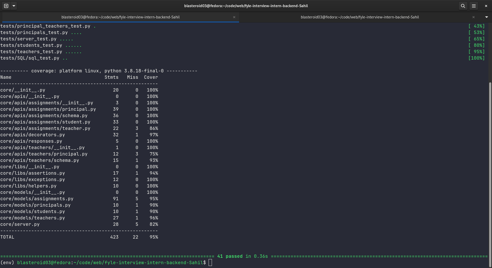
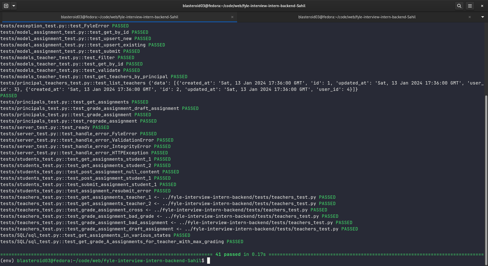
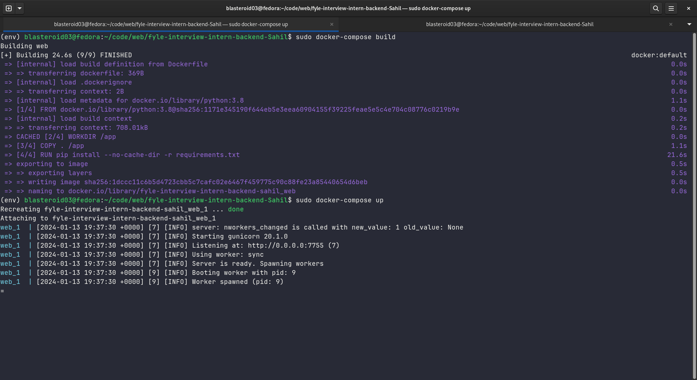

# EduResourceAPI (Fyle Backend Challenge)

## Overview
This Python script uses the Flask framework to create a RESTful API server for a education management system. It imports necessary modules and libraries, including Flask's jsonify for creating JSON responses, marshmallow for data validation and deserialization, and SQLAlchemy for database operations.

The script registers several API endpoints related to different roles in a education system: students, teachers, and principals. Each role has its own set of resources, which are registered under their respective URL prefixes. For example, student-related resources are registered under the '/student' URL prefix.

The root endpoint ('/') is defined to return a JSON response indicating that the server is ready, along with the current UTC time.

The script also includes error handling for exceptions. It defines a global error handler that catches all exceptions. If the exception is an instance of FyleError, a custom exception class, it returns a JSON response with the error message. Other types of exceptions are not handled in this snippet.

### API Doc
See the [API doc](./API_DOCS.md) for more detail. 

## Installation

1. Fork this repository to your github account
2. Clone the forked repository and proceed with steps mentioned below

### Install requirements

```
virtualenv env --python=python3.8
source env/bin/activate
pip install -r requirements.txt
```
### Reset DB

```
export FLASK_APP=core/server.py
rm core/store.sqlite3
flask db upgrade -d core/migrations/

OR

bash reset_DB.sh
```
### Start Server

```
bash run.sh
```
### Run Tests

```
pytest -vvv -s tests/

# for test coverage report
# pytest --cov 
pytest --cov --cov-report=html:./result/coverage_re

# open ./result/coverage_re/index.html
```

### Test Coverage Report
You can see the test coverage report at this [link](https://fork-of-sahil.github.io/EduResourceAPI/).

### Run Docker

```
docker-compose build
docker-compose up
```

## Screenshots

### Test Coverage (95%)


### Test Cases Passed (41 Test Cases)


### Docker Running Screenshot



# About Me

Hello! 👋 I'm Sahil, a computer science enthusiast with a passion for low-level understanding and fundamentals. My journey spans across diverse domains like Android, Cloud, Cybersecurity, IoT, Web and UI/UX. From coding to exploring the intricacies of technology, I love the challenge of turning concepts into practical solutions. 

### Know More About Me

- [Resume](https://drive.google.com/drive/folders/1B199gG2kvLzAQXVJkyNJSvkWBlOCzwuE?usp=drive_link)
- [Linkedin](https://www.linkedin.com/in/sahilkamate03/)
- [GitHub](https://github.com/sahilkamate03)
- [Cover Letter](https://encouraging-citrus-85c.notion.site/Cover-Letter-4f835aafca8044f99cbbe51e38cb6492)